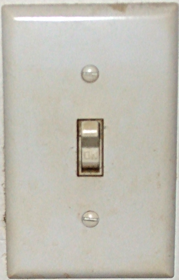
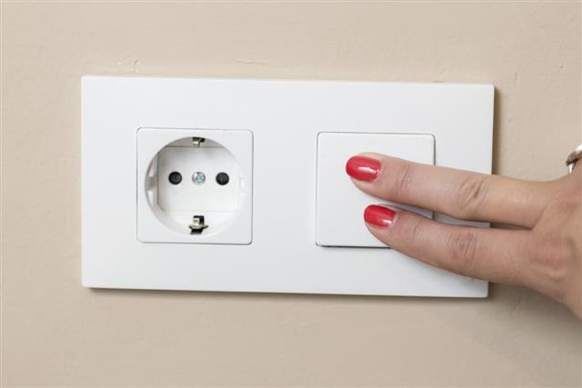
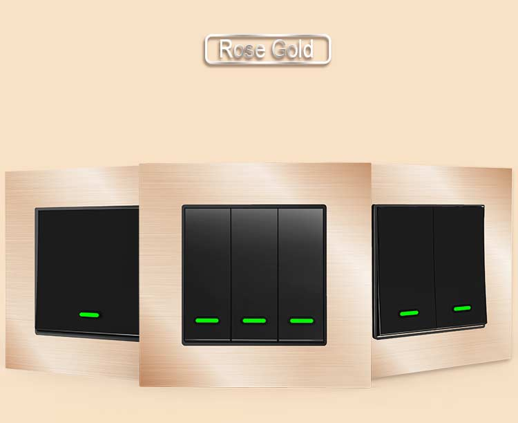
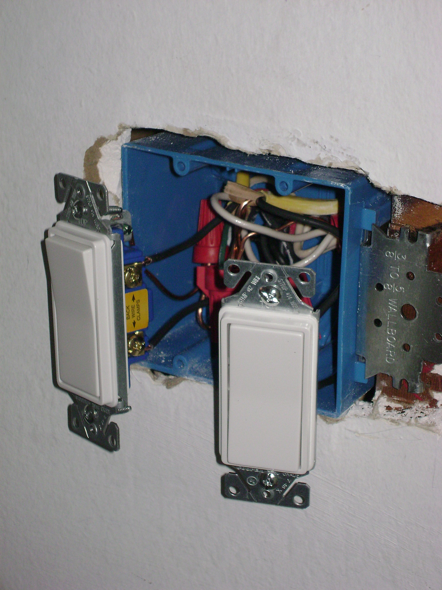
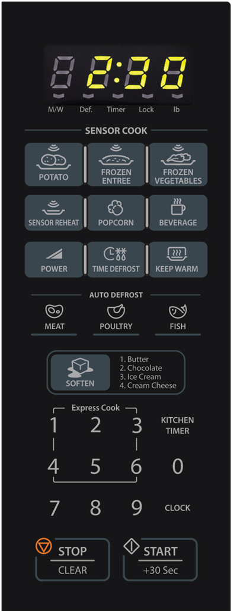
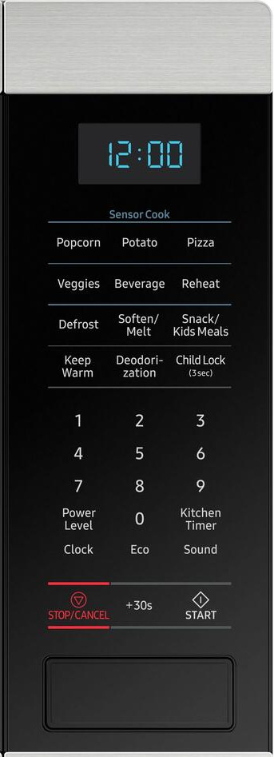
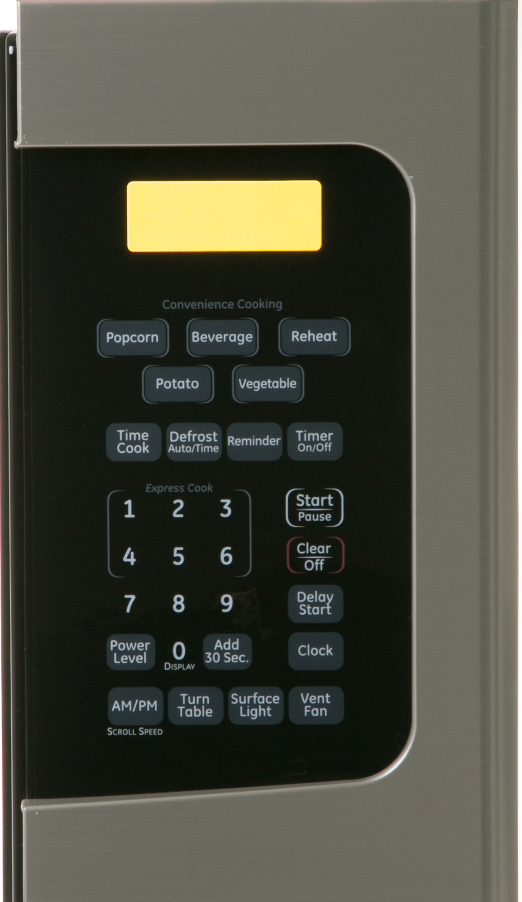
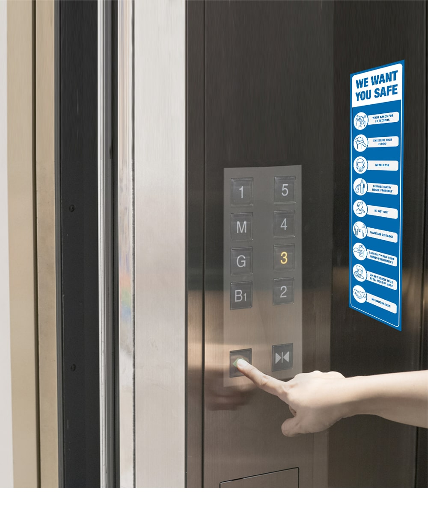
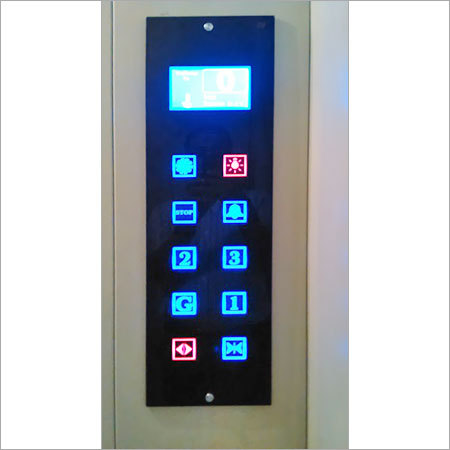
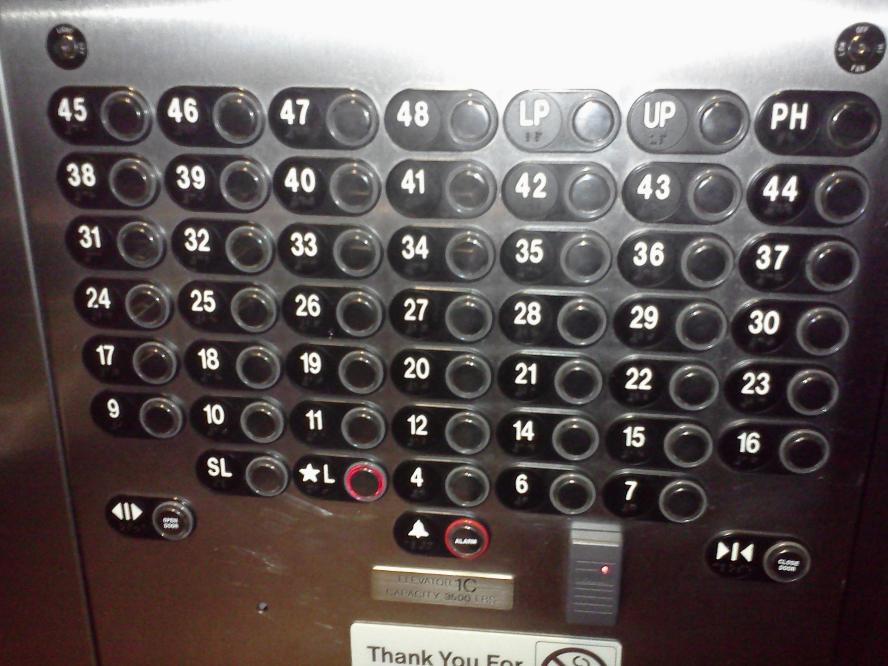

***Head

:::Icon logos/favicon.ico
:::CSS ../node_modules/normalize.css/normalize.css minify
:::CSS ../resources/styles.css minify
:::Script ../resources/scripts/general-conf.js minify
:::Script https://cdn.jsdelivr.net/npm/mathjax@3.1.0/es5/tex-mml-chtml.js
:::

***

***TitleSlide

:::Title Team Project: A11y Bootcamp
:::Subtitle Usability, Accessibility, and more
:::
:::Author Volker Sorge
[v.sorge@cs.bham.ac.uk](mailto:v.sorge@cs.bham.ac.uk)
:::

***Affiliations
:::Affiliation
University of Birmingham, UK
{height=150}
[cs.bham.ac.uk/~vxs](https://www.cs.bham.ac.uk/~vxs)
:::

*******************

## Overview

* What is A11y: Accessibilty?
* General Usability 
* Particular Accessibility
* Testing
* Assessment
* General Remarks

## Usability

* Usability according to Wikipedia is the capacity of a system to allow users to perform tasks 
    * safely,
    * effectively, and 
    * efficiently
    * while enjoying the experience.

Unfortunately,
* Functionality is often easy to achieve
* Making it usable is much harder

## General Usability

* Example: Light switch
* Find it and switch the lights on (or off)

{width="300"}
{width="400"}
{width="300"}
{width="300"}

## General Usability (2)

* Example: Light switch
    * safe: If there are no life wires!
    * effective: Does it switch the light on/off?
    * efficient: Can I find it in the dark?
    * enjoyable: maybe if you have a dimmer...
    
* Just inserting a switch in a circuit is easy
* But it is important to put it somewhere reachable, safe, operable by
  anyone regardless of size, strength, age, etc.

## General Unusability

* Example: The Microwave Panel
* What are all these buttons for?

{width="250"}
{width="250"}
{width="450"}

## Particular Unusability

* Example: Elevator Panel
* Find your floor and get there 
* ... if you can

{width="300"}
{width="400"}
{width="500"}

## Software Usability

Traditionaly Usability has been equated with Accessibility. In software it is an
important concept for all!

* effective: Is it servicable for what I want to do?
* efficient: Does it help me to do my task or does it get in the way?
* enjoyable: The first two often define this!
* safe: How severe are mistakes?

Additional aspects

* learnability and memorability
    * Do I need a certificate to understand the software?
    * Do I have to relearn after not using a system for a while?

## Achieving Usability

* Usability for one is unusablity for another
* Try to find a common ground

_A product should be usable by everyone regardless of age, disability or special
  needs_

* General Principle of Universal Design
* Particular aspect is Accessibility

## Importance and misconceptions

* Usability has to look good
    * Design is not equal to aesthetics
* Usability cannot be measured
    * Not true. E.g. Fitts's law for average time to complete a task with point-and-click

$$
T=a+b\log _{2}{\Bigg (}1+{\frac {D}{W}}{\Bigg )} 
$$ 

* Accessibility is expensive
    * Maintaining a poorly designed system is more expensive
    * Loosing users is loosing customers
    * Law-suits cost money!

Designing for everyone is important!

## Fitts's law variabls Explanations{.notes}

  * T is the average time taken to complete the movement.
  * {\displaystyle a}represents the start/stop time of the device and 
  * {\displaystyle b} stands for the inherent speed of the device. 
  * These constants can be determined experimentally by fitting a straight line to measured data.
  * {\displaystyle D} is the distance from the starting point to the center of the target.
  * {\displaystyle W} is the width of the target measured along the axis of motion.
  *  {\displaystyle W} can also be thought of as the allowed error tolerance in
     the final position, since the final point of the motion must fall within
  *  {\displaystyle \pm {\frac {W}{2}}} of the target's centre.

## Universal Design

A product and a process

* Design that is usable by all people
    * Not always possible!
* Design that works for as many people as possible
    * Design to extent the reach of your product to a wide audience
* Design that has no need for adaptation
    * Do not design special cases, add-ons, extra layers, etc.

## Accessibility

Usability for users with special needs

👁 Visual: blindness, low vision, impaired vision, distracted vision

👂 Aural: deaf, hard of hearing, distracted hearing

🖐 Movement: limited use of extremities, slow reaction time, limited fine motor
skills

🧠 Cognition: Dyslexia, Dyscalculia, Distraction, Memory deficits

*We are all not fully able at some point in our life*

## From Specialist Support to Mainstream

* Voice output: designd BVI community
    * Everyone listens to audiobooks, home assistants, etc.
* Voice input: designd for motor impaired people
    * We all talk to our assistants, SatNavs, etc.
* Subtitles: Originally designed for DHH community
    * Many watch with CC by default
* Large fonts, Screen magnification, Dark modes, High contrast, ...

## 

## Accessibility Personas: Guide

## Accessibility Personas: Links

## Some Accessibility Concepts

* Keyboard accessibility
    * Every task should be a achievable with keyboard only
* Visual adaptability
    * Fonts can be enlarged or even changed
    * Colour palette supports high contrast
    * Magnification and zoom available
* Provision of Alternatives
    * Visual aids are prorvided with alternative descriptions
    * Sounds or voice output is subtitled or replaced by visual clues
* 

Things to avoid:

* 
* What are traps, pitfalls, **dead-ends**?
    * Classic dead-end in keyboard accessibilty:
    A field you tab into but never get out without using the mouse.
    
## A11y Testing

Do some simple tests that consume very little time

* Zoom 
  * How does content react when zooming in or out?
  * Just a few key strokes
* High Contrast
  * What if you change the colour palette?
  * One Chrome extension, one key stroke
* Keyboard interaction
  * Can you reach everything without a mouse?
  * Multiple keystrokes

See in desktop settings of your OS how to use them.

##  A11y Testing (2)

* Form Factors (desktop, laptop, tablet, mobile ... )
  * Simulate in browser
* Screen reading
  * Try a screen reader yourself
    * Windows: Narrator (Windows + Enter),
      [NVDA](https://www.microsoft.com/en-us/p/nvda-nonvisual-desktop-access/9nvl6z0tm57d?activetab=pivot:overviewtab),
      [Jaws](https://www.freedomscientific.com/products/software/jaws/),
    * Apple Mac: Voiceover (Command + F5) 
    * Linux: [Orca](https://gitlab.gnome.org/GNOME/orca) (Super + Alt + S)
    * Chrome/ChromeOS: ChromeVox
    * iOS: Voiceover (in Settings)
    * Android: TalkBack (in Settings)
* ...

## Defining Accessibility

**Accessibility is a process focusing on people**

## POUR Principles

WCAG's core principles:

All content must be

* Perceivable
    * Alt text, sub-titles
* Operable
    * Keyboard, touch
* Understandable
    * Language, Icons
* Robust
    * Not just for OS X, Browser Y or screen reader Z

for **all** users.

## Assessment

We will test your product for accessibility. In particular

* Keyboard accessibility
* Visual adaptability
    * Magnification and zoom
    * Fonts
    * Contrasts and colour
* Screen reading compatibility
* Provision of alternatives 
    * text or sound for graphics
    * visual cues for sounds
Other features depending on the particular application you implement

## Assessment Tips

Document all your accessibility efforts

* If there is something you can not make accessible:
  * Discuss 
  
*   * highlight what works
  * describe what is challenging
  * document limitations
  * do not try to hide them

## General Remarks

* Organise your team
    * Assign responsibilities and roles
    * Choose an Accessibility Evangelist
* Organise your communication
    * Consider [Slack](https://slack.com/) for easy gitlab integration
    * Chat platform with Video everywhere (Discord or Signal over WhatsApp)
* Organise your coding
    * Choose a coding and commenting style
    * Use Merge requests and code reviews
* Organise your continuous integration
    * Think about semantic versioning
    * [Meaningful commit messages](https://reflectoring.io/meaningful-commit-messages/)
    * [Automate release note](https://github.com/angular/angular/blob/master/CONTRIBUTING.md#commit)

## Myself as a Resource

* Make use of my experience on some of the above
* Email me, or drop me a chat on deparmental zoom or teams
  * I am often slow to reply!
  * Ping me again after a day or two.
* I will announce weekly drop in sessions for A11Y issues (on zoom, teams, or
  similar)

But note:

* I can give you general advice
* I will **not**
    * solve your specific problems
    * debug your software
    
**If you have more interest in Accessibility, talk to me**

## Thursday's Lecture/Lab

* Mop-up session
* Q\&A only
* I will not present prepared content
* One person per team
* Send you Accessibility Evangelist

## A11Y Resources: Testing per OS

* For desktop
  * [Windows](https://docs.microsoft.com/en-us/windows/win32/accessibility/accessibility)
  * [MacOS](https://developer.apple.com/library/archive/documentation/Accessibility/Conceptual/AccessibilityMacOSX/OSXAXTestingApps.html)
  * []
* For web applications (mostly for webkit based browsers)
  * WCAG [Access Audit UI](https://chrome.google.com/webstore/detail/wcag-accessibility-audit/kpfleokokmllclahndmochhenmhncoej)
* [Accessibility Insights for the Web](https://chrome.google.com/webstore/detail/accessibility-insights-fo/pbjjkligggfmakdaogkfomddhfmpjeni)
* WebAIM [WAVE Evaluation
  Tool](https://chrome.google.com/webstore/detail/wave-evaluation-tool/jbbplnpkjmmeebjpijfedlgcdilocofh)
* For mobile
  * [Android Accessibility](https://developer.android.com/guide/topics/ui/accessibility/testing)
  * [iOS Accessibility](https://developer.apple.com/library/archive/technotes/TestingAccessibilityOfiOSApps/TestingtheAccessibilityofiOSApps/TestingtheAccessibilityofiOSApps.html)

## A11Y Resources

* [Microsoft](https://www.microsoft.com/accessibility)
* [Google](https://www.google.com/accessibility/)
* [Apple](https://www.apple.com/accessibility/)
* [Amazon](https://www.amazon.com/b/?node=15701038011)
* [IBM](https://www.ibm.com/able/)

## A11Y Guidelines

* [Web Content Accessibility Guidelines (WCAG)](https://www.w3.org/TR/WCAG21/)
  * ~60 "Success Criteria" across 3 Levels: A, AA, AAA
  * A&AA is the legal basis in most countries, AAA optional/ideal
  * many criteria cover forms & applications, not "just" content
  * Accompanying specs:
    * [Understanding WCAG](https://www.w3.org/WAI/WCAG21/Understanding/)
    * [WCAG Quick Reference](https://www.w3.org/WAI/WCAG21/quickref/)
* Shorter: [W3C Accessibility Principles](https://www.w3.org/WAI/fundamentals/accessibility-principles/) [WebAIM WCAG Checklist](https://webaim.org/standards/wcag/checklist)
* More: [WebAIM article](https://webaim.org/articles/)

