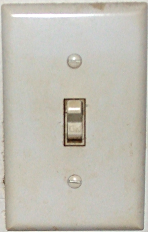
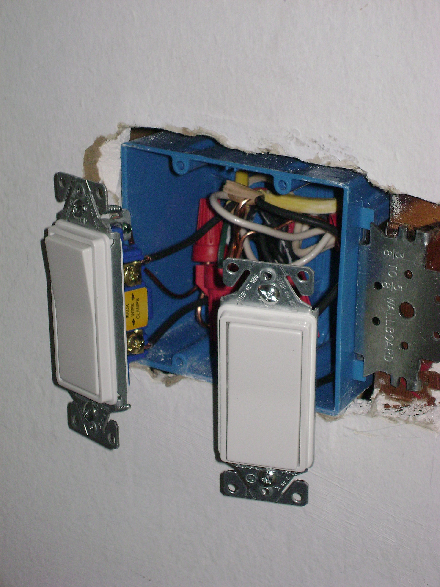
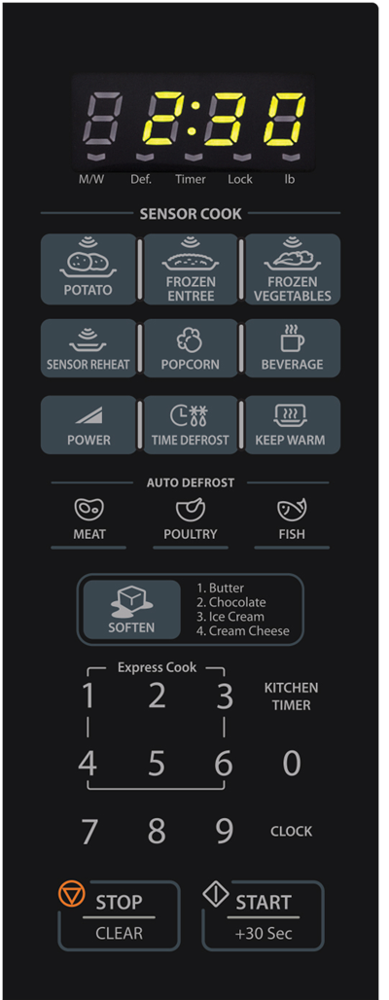
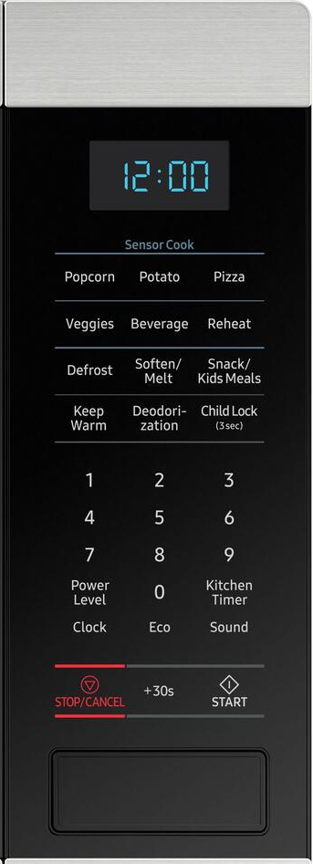
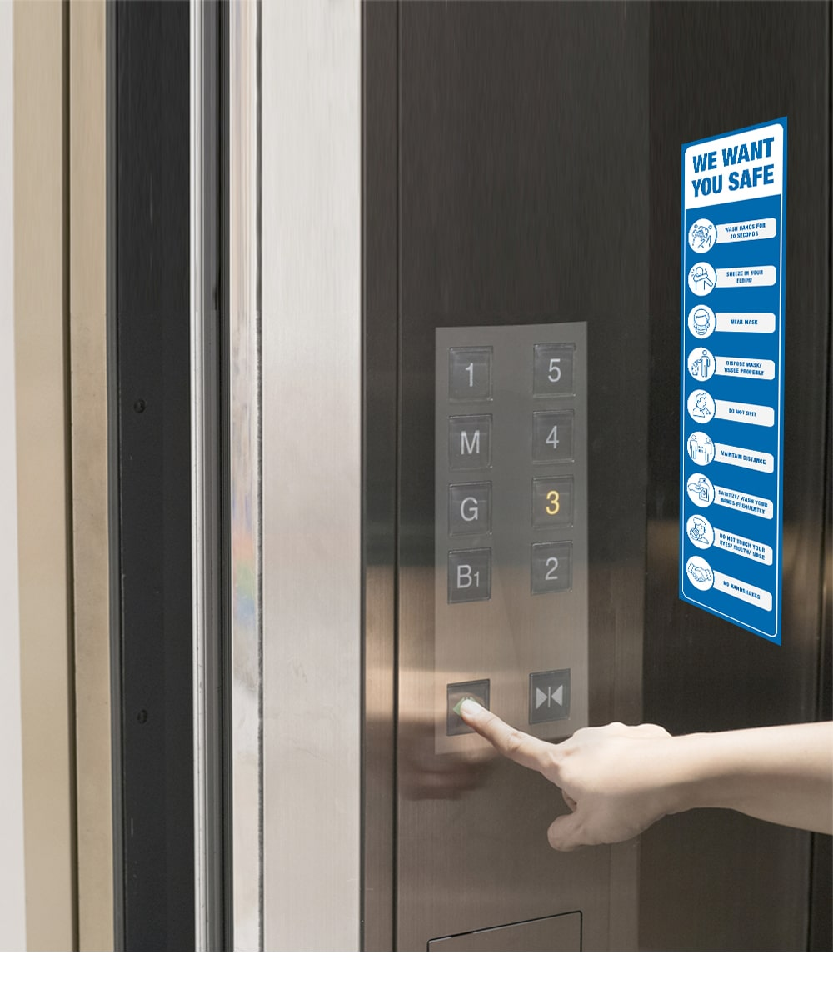

***Head

:::Icon ./resources/logos/crest-favicon.ico
:::CSS ./node_modules/normalize.css/normalize.css minify
:::CSS ./resources/styles.css minify
:::Script ./resources/scripts/general-conf.js minify
:::Script https://cdn.jsdelivr.net/npm/mathjax@3.1.0/es5/tex-mml-chtml.js
:::

***

***TitleSlide

:::Title Team Project: A11y Bootcamp
:::Subtitle Usability, Accessibility, and more
:::
:::Author Volker Sorge
[v.sorge@cs.bham.ac.uk](mailto:v.sorge@cs.bham.ac.uk)
:::

***Affiliations
:::Affiliation
University of Birmingham, UK
{height=150}
[cs.bham.ac.uk/~vxs](https://www.cs.bham.ac.uk/~vxs)
:::

*******************

## Overview

* What is Usability 
* What is A11y: Accessibility?
* Persona
* Desktop and Web Apps
* Testing
* Assessment Remarks
* General Remarks

## (Homework) Exercise 1

If you have a laptop with you, work with it WITHOUT using the mouse/touchpad:

* Login (maybe log out first)
* Open the Chrome browser
* Navigate to [https://zorkow.github.io/team-project](https://zorkow.github.io/team-project/)
* Tab to the [2024 link](https://zorkow.github.io/team-project/2024)
* Press Return

Homework: Try to work with your desktop/laptop for 30 minutes without touching the mouse!

## Usability

* Usability according to Wikipedia is the capacity of a system to allow users to perform tasks 
    * safely,
    * effectively, and 
    * efficiently
    * while enjoying the experience.

Unfortunately,
* Functionality is often easy to achieve
* Making it usable is much harder

## General Usability

* Example: Light switch
* Find it and switch the lights on (or off)

{width="350"}
{width="450"}
{width="350"}
{width="350"}

## General Usability (2)

* Example: Light switch
    * safe: If there are no life wires!
    * effective: Does it switch the light on/off?
    * efficient: Can I find it in the dark?
    * enjoyable: maybe if you have a dimmer...
    
* Just inserting a switch in a circuit is easy
* But it is important to put it somewhere reachable, safe, operable by
  anyone regardless of size, strength, age, etc.

## General Unusability

* Example: The Microwave Panel
* What are all these buttons for?

{height="700"}
{height="700"}
{height="700"}

## Particular Unusability

* Example: Elevator Panel
* Find your floor and get there 
* ... if you can

{width="400"}
{width="500"}
{width="600"}

## Software Usability

Traditionally Usability has been equated with Accessibility. In software it is
an important concept for all!

* effective: Is it serviceable for what I want to do?
* efficient: Does it help me to do my task or does it get in the way?
* enjoyable: The first two often define this!
* safe: How severe are mistakes?

Additional aspects

* learnability and memorability
    * Do I need a certificate to understand the software?
    * Do I have to relearn after not using a system for a while?

## General Usability and Accessibility

_A product should be usable by everyone regardless of age, disability or special
  needs_

* Particular aspect of Usability is Accessibility
* Usability for one is unusablity for another
* Try to find a common ground
* General Principle of Universal Design

## Importance and misconceptions{.notes}

* Usability has to look good
    * Design is not equal to aesthetics
* Usability cannot be measured
    * Not true. E.g. Fitts's law for average time to complete a task with point-and-click

$$
T=a+b\log _{2}{\Bigg (}1+{\frac {D}{W}}{\Bigg )} 
$$ 

* Accessibility is expensive
    * Maintaining a poorly designed system is more expensive
    * Losing users is losing customers
    * Law-suits cost money!

Designing for everyone is important!

## Fitts's Law Variables Explanations{.notes}

  * T is the average time taken to complete the movement.
  * {\displaystyle a}represents the start/stop time of the device and 
  * {\displaystyle b} stands for the inherent speed of the device. 
  * These constants can be determined experimentally by fitting a straight line to measured data.
  * {\displaystyle D} is the distance from the starting point to the center of the target.
  * {\displaystyle W} is the width of the target measured along the axis of motion.
  *  {\displaystyle W} can also be thought of as the allowed error tolerance in
     the final position, since the final point of the motion must fall within
  *  {\displaystyle \pm {\frac {W}{2}}} of the target's centre.

## Universal Design

A product and a process

* Design that is usable by all people
    * Not always possible!
* Design that works for as many people as possible
    * Design to extent the reach of your product to a wide audience
* Design that has no need for adaptation
    * Do not design special cases, add-ons, extra layers, etc.

## Accessibility

Usability for users with special needs

👁 Visual: blindness, low vision, impaired vision, distracted vision

👂 Aural: deaf, hard of hearing, distracted hearing

🖐 Movement: limited use of extremities, slow reaction time, limited fine motor
skills

🧠 Cognition: Dyslexia, Dyscalculia, Distraction, Memory deficits

## Is this really important?

* Is this not something for specialists only?
    * Every software engineer needs to understand basic accessibilty
      considerations
    * Mistakes at back end design, data structures, development stack selection
      can destroy the ability to make software accessible
* Is designing for everyone important?
    * Every user facing software should be accessible
    * Maintaining a poorly designed system is more expensive
    * Losing users is losing customers
    * Law-suits cost money!

*We are all not fully able at some point in our life*

## Types of Disabilities

* Permanent
* Temporary
* Situational

Examples:

* Vision: Blind — after eye operation — sitting in the sun
* Sound: deaf — ear infection — noisy environment
* Motor: loss of limb — broken arm — carrying shopping bag

## From Specialist Support to Mainstream

* Voice output: designed BVI community
    * Everyone listens to audiobooks, home assistants, etc.
* Voice input: designed for motor impaired people
    * We all talk to our assistants, SatNavs, etc.
* Subtitles: Originally designed for DHH community
    * Many watch with CC by default
* Dark modes: aimed at low vision and dyslexia support
    * Now more important than ever...
* High contrast, Large fonts, Screen magnification, ...

## Dark Mode Example

{width="700"}
{width="700"}

## Exercise 2

* Get your phone out
* Find accessibility settings
* Switch on VoiceOver (iOS) or TalkBack (Android)
* ... good luck

## Defining Accessibility: POUR Principles

[WCAG's core principles](https://webaim.org/articles/pour/): POUR

For **all** users, **all** content must be

* Perceivable
    * Alt text, sub-titles
* Operable
    * Keyboard, touch
* Understandable
    * Language, Icons
* Robust
    * Not just for OS X, Browser Y or screen reader Z

## Exercise 2 (continued)

Perception in the context of screen reading.

Example: Using the back button consists of two actions.

* Visual task
    1. Perception: See the button with backarrow
    1. Operation: Touch the button to trigger action
* Non-visual task
    1. Perception: Hear the button's function with initial tap
    1. Operation: Tap the button again to trigger action
    

## Some Accessibility Concepts

* Keyboard accessibility
    * Every task should be a achievable with keyboard only
* Visual adaptability
    * Fonts can be enlarged or even changed
    * Colour palette supports high contrast
    * Magnification and zoom available
* Provision of Alternative media
    * Visual aids are supplied with alternative descriptions
    * Sounds or voice output is subtitled or replaced by visual clues

## Accessibility Personas: Guide

Create Personas that cover some of the major a11y concepts

Some helpful resources:

* [Four Example Personas](https://qvik.com/news/four-personas-to-help-you-create-accessible-digital-services/)
* [UK Government](https://accessibility.blog.gov.uk/2019/02/11/using-persona-profiles-to-test-accessibility/)
* [UK Government sources](https://alphagov.github.io/accessibility-personas/)

Also think about how it can improve the User Experience of every user
  *  Different ages,
  *  Environment of use of software
  *  ...

## A11y in Design Workflow

* Not just a front end consideration
* Consider all the information you need
* Make sure that your data structures a general enough for all use cases
* Ensure your back-end exhibits everything you need at the front-end
* Avoid premature optimisation 
    * Do not throw information away that you might need at a later point!

## Designing with A11y in Mind

Do not try to retro-fit as this is often impossible!

Good approaches:

1. Think about all the users that can benefit from your product
2. Consider as many corner case as possible
3. What are the requirements for your software to satisfy these?
4. Where do you need to make allowances for different needs?

Non-Accessibility is expensive: Lawsuits cost money!

## Accessibility in Practice

  * Desktop programs
  * Web applications
  * Mobile apps

## Accessibility of Desktop Applications

* Standard widgets get accessibility support from OS
* Careful with transitions: Content vs "Chrome"

{width="550"}
{height="200"}
{width="250"}

* Avoid overly handcrafted UIs
* Traps and pitfalls: **dead-ends**
    * Classic dead-end in keyboard accessibilty:
      A field you tab into but never get out without using the mouse.

## Web Applications

* No standard layout for your web components
* Widgets can be build in a myriad of ways
* Example: drop down menu
    * [A bad example](https://www.dropdownmenugenerator.com/)
    * [A good example](https://blog.hubspot.com/website/html-dropdown)
    
Use the web trinity:

* HTML/CSS: Basic elements with styling or Syntax 
* JavaScript: Functionality
* [ARIA](https://www.w3.org/WAI/standards-guidelines/aria/): Describe meaning or Semantics

## Making Web Components Accessible

* Use a reasonable page layout
* Use logical  structures like `header`, `main`, `footer`, etc.
* [Roles to describe](https://developer.mozilla.org/en-US/docs/Web/Accessibility/ARIA/Roles)
    * standard widget for menu, interaction elements and states, ...
    * content regions, headings, tables, ...
* Navigation enhancements via landmarks
    * Complement the HTML regions
* Keyboard navigation via [`tabindex`](https://developer.mozilla.org/en-US/docs/Web/HTML/Global_attributes/tabindex)
  * Finetune using [roving tabindices](https://www.freecodecamp.org/news/html-roving-tabindex-attribute-explained-with-examples/)
* [Live regions](https://developer.mozilla.org/en-US/docs/Web/Accessibility/ARIA/ARIA_Live_Regions) to alert to changing content

## Mobile Devices

* Very similar to web accessibility
* Equally important
* But even harder

## Exercise 3

* Switch off the screen reader (if you've switched it on)
* Log off

## A11y Testing

Do some simple tests that consume very little time

* Zoom 
  * How does content react when zooming in or out?
  * Just a few key strokes
* High Contrast
  * What if you change the colour palette?
  * One Chrome extension, one key stroke
* Keyboard interaction
  * Can you reach everything without a mouse?
  * Multiple keystrokes

See in desktop settings of your OS how to use them.

##  A11y Testing (2)

* Form Factors (desktop, laptop, tablet, mobile ... )
  * Simulate in browser
* Web accessibility with the [Lighthouse tool](https://developers.google.com/web/tools/lighthouse/) in your browser
* Screen reading
  * Try a screen reader yourself
    * Windows: Narrator (Windows + Enter),
      [NVDA](https://www.microsoft.com/en-us/p/nvda-nonvisual-desktop-access/9nvl6z0tm57d?activetab=pivot:overviewtab),
      [Jaws](https://www.freedomscientific.com/products/software/jaws/),
    * Apple Mac: Voiceover (Command + F5) 
    * Linux: [Orca](https://gitlab.gnome.org/GNOME/orca) (Super + Alt + S)
    * Chrome/ChromeOS: ChromeVox
    * iOS: Voiceover (in Settings)
    * Android: TalkBack (in Settings)
* ...

## Assessment

We will test your product for accessibility. In particular

* Keyboard accessibility
* Visual adaptability
    * Magnification and zoom
    * Fonts
    * Contrasts and colour
* Screen reading compatibility
* Provision of alternatives 
    * text or sound for graphics
    * visual cues for sounds
Other features depending on the particular application you implement

## Assessment Tips

Document all your accessibility efforts
  
  * highlight what works
  * describe what is challenging
  * document limitations
  * do not try to hide them
  
There can be parts you can not make accessible
  * Discuss what are the problems are
  * What could be a possible solution?

## General Remarks

* Organise your team
    * Assign responsibilities and roles
    * Choose an Accessibility Evangelist
* Organise your communication
    * Chat platform with Video everywhere (Discord or Signal over WhatsApp)
* Organise your coding
    * Choose a coding and commenting style
    * Use Merge requests and code reviews
* Organise your continuous integration
    * Think about semantic versioning
    * [Meaningful commit messages](https://reflectoring.io/meaningful-commit-messages/)
    * [Automate release notes](https://github.com/angular/angular/blob/master/CONTRIBUTING.md#commit)

## Drop-In Office Hours

Thursday 10am-12pm / Friday 1-2pm UG04 Lab

* I will be in the lab
* Come and talk to me
* Not mandatory

## A11Y Office Hours

* We will have dedicated A11Y office hour every week
* Exclusively for A11Y related questions
* Online on Zoom
* We will announce time and date on Canvas

## Use Me as a Resource

* Make use of my experience on some of the above
* Email me, or drop me a chat on departmental zoom or teams
  * I am often slow to reply!
  * Ping me again after a day or two.
* I will announce the weekly drop in sessions for A11Y issues 
* Make use of those for questions

But note:

* I can give you general advice
* I will **not** solve your specific problems, or debug your software
    
**If you have more interest in Accessibility, talk to me**

## A11Y Resources: Testing per OS

* For desktop
  * [Windows](https://docs.microsoft.com/en-us/windows/win32/accessibility/accessibility)
  * [MacOS](https://developer.apple.com/library/archive/documentation/Accessibility/Conceptual/AccessibilityMacOSX/OSXAXTestingApps.html)
  * Linux... not many resources
* For web applications (mostly for webkit based browsers)
  * WCAG [Access Audit UI](https://chrome.google.com/webstore/detail/wcag-accessibility-audit/kpfleokokmllclahndmochhenmhncoej)
* [Accessibility Insights for the Web](https://chrome.google.com/webstore/detail/accessibility-insights-fo/pbjjkligggfmakdaogkfomddhfmpjeni)
* WebAIM [WAVE Evaluation
  Tool](https://chrome.google.com/webstore/detail/wave-evaluation-tool/jbbplnpkjmmeebjpijfedlgcdilocofh)
* For mobile
  * [Android Accessibility](https://developer.android.com/guide/topics/ui/accessibility/testing)
  * [iOS Accessibility](https://developer.apple.com/library/archive/technotes/TestingAccessibilityOfiOSApps/TestingtheAccessibilityofiOSApps/TestingtheAccessibilityofiOSApps.html)

## A11Y Resources

* [Microsoft](https://www.microsoft.com/accessibility)
* [Google](https://www.google.com/accessibility/)
* [Apple](https://www.apple.com/accessibility/)
* [Amazon](https://www.amazon.com/b/?node=15701038011)
* [IBM](https://www.ibm.com/able/)

## A11Y Guidelines

* [Web Content Accessibility Guidelines (WCAG)](https://www.w3.org/TR/WCAG21/)
  * ~60 "Success Criteria" across 3 Levels: A, AA, AAA
  * A&AA is the legal basis in most countries, AAA optional/ideal
  * many criteria cover forms & applications, not "just" content
  * Accompanying specs:
    * [Understanding WCAG](https://www.w3.org/WAI/WCAG21/Understanding/)
    * [WCAG Quick Reference](https://www.w3.org/WAI/WCAG21/quickref/)
* Shorter: [W3C Accessibility Principles](https://www.w3.org/WAI/fundamentals/accessibility-principles/) [WebAIM WCAG Checklist](https://webaim.org/standards/wcag/checklist)
* More: [WebAIM article](https://webaim.org/articles/)

